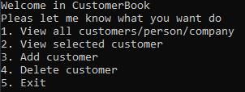

# CustomerBook - console app

## Table of Contents
* [General Info](#general-information)
* [Features](#features)
* [Screenshots](#screenshots)

## General Information

A simple console application for customer management.
The aim of the project is to keep all the customer information needed to create a invoice/billing in one application.

## Features

- create of customers by company/person
- delete of customers
- view customers

## Screenshots

